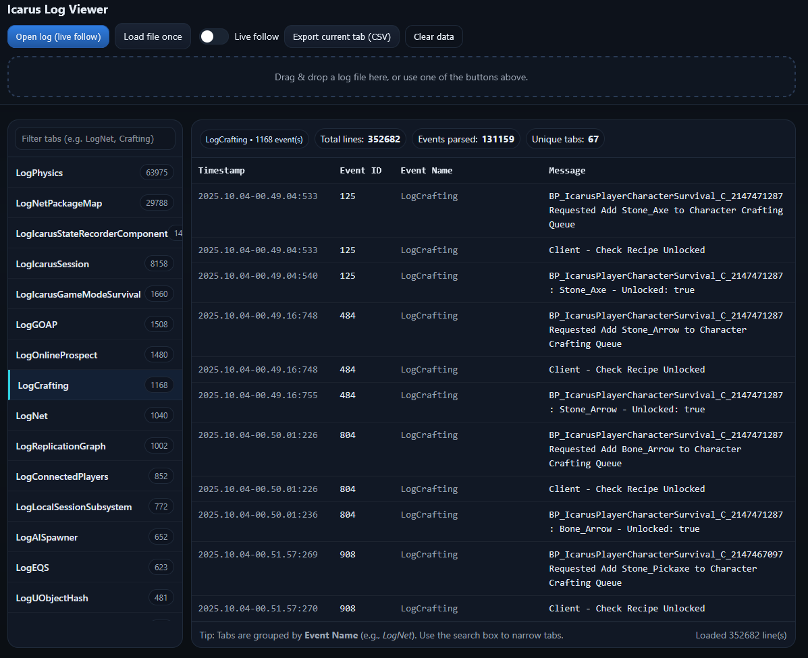

# IcarusLogParser
New to hosting Icarus so I'm trying to figure out what could be useful or fun to parse out of the logs and report via Discord or something. This is my little test repo for it in case anyone else finds it useful.

Just run this html file in your browser and drop your log file on it. I haven't tested pretty much any of it yet, just basic parsing so far.

